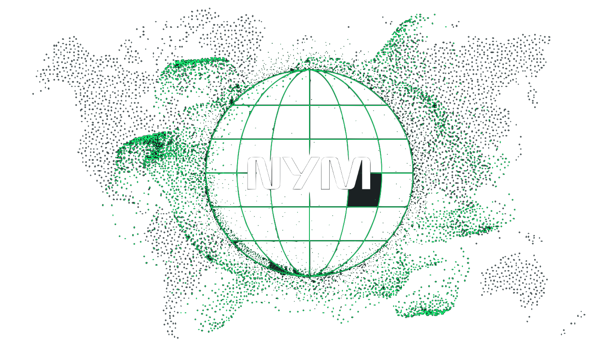
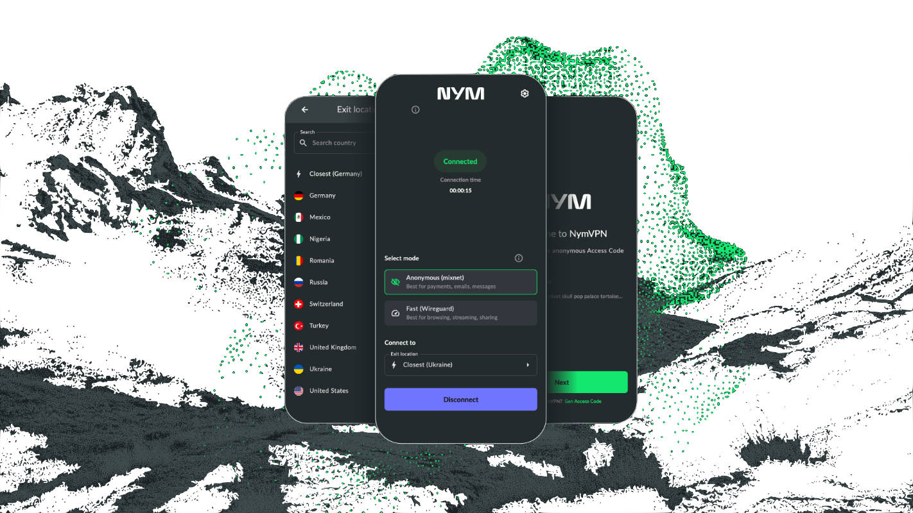

<div align="center">



Open-source, cross-platform VPN client built with Rust that provides true privacy through decentralized mixnet technology and multi-hop censorship-resistant WireGuard tunneling.
</div>

# 🚀 What is NymVPN

NymVPN is a privacy-focused, decentralized VPN application that goes beyond traditional VPNs by leveraging:

- 🔀 [Mixnet](https://nym.com/mixnet) Technology: Anonymous 5-hop routing through Nym's decentralized network
- ⚡ WireGuard + AmneziaWG: Fast, secure tunneling with built-in censorship resistance
- 🛡️ Metadata Protection: Unlike traditional VPNs, protects both content AND traffic patterns (in mixnet mode)
- 🔐 Zero-Knowledge Credentials: Private authentication using zero-knowledge [zk-nyms](https://nym.com/zk-nyms)
- 🌍 No Single Point of Failure: Fully decentralized infrastructure

<div align="left">

</div>

<br />
<br />

<div align="left">

[](https://github.com/nymtech/nym-vpn-client/releases?q=android&expanded=true)
[](https://f-droid.org/packages/net.nymtech.nymvpn/)
[](https://flathub.org/apps/net.nymtech.NymVPN)
[](https://play.google.com/store/apps/details?id=net.nymtech.nymvpn)
[](https://apps.obtainium.imranr.dev/redirect?r=obtainium://app/%7B%22id%22%3A%22net.nymtech.nymvpn%22%2C%22url%22%3A%22https%3A%2F%2Fgithub.com%2Fnymtech%2Fnym-vpn-client%22%2C%22author%22%3A%22nymtech%22%2C%22name%22%3A%22NymVPN%22%2C%22preferredApkIndex%22%3A0%2C%22additionalSettings%22%3A%22%7B%5C%22includePrereleases%5C%22%3Afalse%2C%5C%22fallbackToOlderReleases%5C%22%3Atrue%2C%5C%22filterReleaseTitlesByRegEx%5C%22%3A%5C%22%5C%22%2C%5C%22filterReleaseNotesByRegEx%5C%22%3A%5C%22%5C%22%2C%5C%22verifyLatestTag%5C%22%3Afalse%2C%5C%22dontSortReleasesList%5C%22%3Afalse%2C%5C%22useLatestAssetDateAsReleaseDate%5C%22%3Afalse%2C%5C%22releaseTitleAsVersion%5C%22%3Afalse%2C%5C%22trackOnly%5C%22%3Afalse%2C%5C%22versionExtractionRegEx%5C%22%3A%5C%22%5C%22%2C%5C%22matchGroupToUse%5C%22%3A%5C%22%5C%22%2C%5C%22versionDetection%5C%22%3Afalse%2C%5C%22releaseDateAsVersion%5C%22%3Afalse%2C%5C%22useVersionCodeAsOSVersion%5C%22%3Afalse%2C%5C%22apkFilterRegEx%5C%22%3A%5C%22%5C%22%2C%5C%22invertAPKFilter%5C%22%3Afalse%2C%5C%22autoApkFilterByArch%5C%22%3Atrue%2C%5C%22appName%5C%22%3A%5C%22%5C%22%2C%5C%22shizukuPretendToBeGooglePlay%5C%22%3Afalse%2C%5C%22allowInsecure%5C%22%3Afalse%2C%5C%22exemptFromBackgroundUpdates%5C%22%3Afalse%2C%5C%22skipUpdateNotifications%5C%22%3Afalse%2C%5C%22about%5C%22%3A%5C%22%5C%22%2C%5C%22refreshBeforeDownload%5C%22%3Afalse%7D%22%2C%22overrideSource%22%3Anull%7D)
[](https://apps.apple.com/app/id6471254143)
[](https://github.com/nymtech/nym-vpn-client/releases?q=linux&expanded=true)
[](https://github.com/nymtech/nym-vpn-client/releases?q=macos&expanded=true)
[](https://github.com/nymtech/nym-vpn-client/releases?q=windows&expanded=true)

</div>

# ✨ Key Features

🎯 Dual-Mode Privacy Architecture

- Anonymous Mode (5-hop mixnet): Maximal anonymity thanks to Nym's Noise Generating Mixnet with added noise to protect users against even AI surveillance
- Fast Mode (2-hop WireGuard): Decentralized 2-hop mode for faster connections and less latency thanks to WireGuard

🔧 Developer-Friendly

- 100% Open Source: Fully auditable codebase
- Rust-based: Memory-safe, high-performance implementation
- Cross-platform: Android, iOS, Linux, macOS, Windows, CLI

⚙️ Power User Features

- Split Tunneling: Choose per-app routing (mixnet vs WireGuard) (_coming soon_)
- Custom Entry/Exit Selection: Choose your preferred node operators
- Kill Switch: Automatic connection protection with data leak prevention
- Multi-language Support: 10+ localizations with crowdsourced language support

🛡️ Advanced Privacy and Security

- Multi-hop by Default: No server views both your IP address and online activity
- zk-nyms: Private zero-knowledge credential system to unlink payments data from online activity
- No Centralized Logging: Cryptographically impossible to track users
- Advanced Cryptographic Stack: Cure25519, AES, ChaCha20-Poly1305, BLAKE2/BLAKE3, Lioness Wide Block Cipher, Pointcheval-Sanders Signatures, Pedersen Commitments, NIZK Proofs, BLS12-381 Curve, post-quantum readiness (_coming soon_)
- Independent Security Audits: JP Aumasson (2021), Oak Security (2022), Cryspen (2023-2024), Cure53 (2024)

🌐 Censorship Resistance Technologies

- AmneziaWG Integration: Bypass barriers to information access with AmneziaWG (censorship-resistance WireGuard fork)
- Adaptive Protocols: Pluggable transport, QUIC (_coming soon_)

# 🏗️ Architecture

```
┌─────────────────┐    ┌──────────────┐    ┌─────────────────┐
│                 │ -> │   Mixnet     │ -> │   Destination   │
│                 │    │  (5 hops)    │    │                 │
│    NymVPN App   │    └──────────────┘    └─────────────────┘
│    (Rust Core)  │    ┌──────────────┐    ┌─────────────────┐
│                 │ -> │  AmneziaWG   │ -> │   Destination   │
│                 │    │  (2 hops)    │    │                 │
└─────────────────┘    └──────────────┘    └─────────────────┘
```

# 🌐 Use Cases

For Privacy Advocates

- Personal privacy: Protection from ISP/government surveillance
- Journalist protection: Secure communication in hostile environments
- Whistleblowing: Anonymous document sharing

For Developers

- Decentralized app integration: Privacy layer for dApps
- Research projects: Privacy-preserving network protocols
- Security auditing: Open-source cryptographic implementations

For Organizations

- Corporate security: Enhanced privacy for remote teams
- Censorship circumvention: Access blocked content and services
- Compliance: GDPR-friendly privacy infrastructure

# 🔬 Research Foundation & Academic Partnerships

Peer-Reviewed Research ([50+ Publications](https://nym.com/trust-center/papers-and-research))

Academic Partnerships

- [KU Leuven (COSIC Research Group)](https://www.esat.kuleuven.be/cosic/): Privacy, performance, and hardware optimization
- [EPFL (SPRING Lab)](https://spring.epfl.ch): Network security and sophisticated attack analysis
- [Cryspen](https://cryspen.com): Formal verification and post-quantum cryptography

Advisory Board with multiple industry awards (Levchin Prize, BCS Lovelace Medal)

# 📚 Documentation & Resources

- 🛡️ [The NymVPN Litepaper](https://nym.com/nymvpn-litepaper)
- ♟️ [NymVPN public roadmap](https://trello.com/b/qVhBo3e2/nymvpn-public-roadmap)
- 👀 [NymVPN Signals of Trustworthy VPNs](https://nym.com/trust-center/signals-of-trustworthy-vpns)
- 🌐 [Nym Crowdsouced Localization](https://crowdin.com/editor/nymvpn-apps)

- 🙏 [Nym's Help Center](https://support.nym.com/hc/en-us)
- 🏡 [Nym Forum](https://forum.nym.com)
- 🍀 [Nym's Trust Center](https://nym.com/trust-center)
- 🔬 [Nym Audits](https://nym.com/trust-center/independently-audited)
- 🧪 [Nym Research Papers](https://nym.com/trust-center/papers-and-research)
- 🔐 [Nym Cryptography](https://nym.com/trust-center/cryptography)

- 💡 [The Nym Network Whitepaper](https://nym.com/nym-whitepaper.pdf)
- 📣 [Nym's blog](https://nym.com/en/blog).

# 🤝 Contributing

We welcome contributions from developers passionate about privacy, decentralization, and open-source software! This monorepo contains all of our source code for our NymVPN client apps (iOS / Android / Linux / macOS / Windows / CLI), separate from the Nym network [monorepo](https://github.com/nymtech/nym).

Development Areas

- Rust core development: Networking, cryptography, protocols
- Mobile development: Kotlin (Android), SwiftUI (iOS)
- Desktop applications: SwiftUI (macOS), Tauri (Linux, Windows)
- Protocol research: Mixnet improvements, censorship resistance
- Security auditing: Code review, vulnerability research, pen tests

Check our [Contribution Guide](CONTRIBUTING.md).

# 🏷️ Topics & Keywords

- Privacy & Security: `privacy-tools` `privacy-enhancing tech` `security` `encryption` `zero-knowledge` `anonymity` `surveillance-resistance` `cryptography`
- Networking: `vpn` `dvpn` `wireguard` `amneziawg` `mixnet` `decentralized-network` `censorship-resistance`
- Development: `rust` `open-source` `kotlin` `swiftui`
- Protocols: `sphinx` `onion-routing` `distributed-systems` `network-privacy`

# ©️ Licensing and copyright information

- ©2018-2026 Nym Technologies SA (contact@nymtech.net). Nym Technologies SA. Nym and NymVPN is made possible by [Adblock-rust](https://github.com/brave/adblock-rust/) and other [open source](https://opensource.org/osd) and [free software](https://www.gnu.org/philosophy/free-sw.en.html).

# 😍 Acknowledgements

- [Mullvad open source libraries](https://github.com/mullvad/mullvadvpn-app/) to handle setting up local routing and wrapping wireguard-go.
- [AmneziaWG wg-go open source library](https://github.com/amnezia-vpn/amneziawg-go) to help prevent censorship of WireGuard.
- [WireGuard](https://github.com/WireGuard)
- [ablock-rust](https://github.com/brave/adblock-rust) to power our ad-blocking features.

# ⛓️ Community

Connect with the community on our socials.

<div align="left">

[](https://nym.com/go/telegram)
[](https://nym.com/go/matrix)
[](https://nym.com/go/youtube)
[](https://nym.com/go/discord)
[](https://nym.com/go/x)
</div>


Building the future of private, decentralized internet infrastructure - one commit at a time. 🚀
